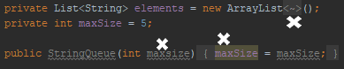

# Lab Report #
## Vertiefende Gesamtwiederholung ##

Student01: Thomas Pretterhofer

Student02: Florian Reisinger

Repository: <a href="https://github.com/FlorianReisinger/19-Abgabe04-Reisinger-Pretterhofer">https://github.com/FlorianReisinger/19-Abgabe04-Reisinger-Pretterhofer</a>

# Tasklist #

- [x] 1. Übertragen Angabe Taskliste in Markdown Readme

- [x] 2. Einspielen Queue Vorlage aus Repository:  
https://github.com/michaelulm/software-configuration-management/tree/master/test-automation/Queue  
            
- [ ] 3. Taskergebnisse Schritt für Schritt auf Git stellen
  - [ ] Führung Taskliste
  - [ ] Veröffentlichung in Git mit aktuell durchgeführten Tätigkeiten, z.B. Testfälle geschrieben so wird auch in der Taskliste diese Aufgabe als erledigt markiert und Testfälle inkl. geänderter Taskliste ins Repository übertragen.
    
- [x] 4. Korrigieren Sie den Code bzw. Debuggen Sie ihn um die Fehler zu finden
  - [x] Es befinden sich gesamt 3 Fehler im Source Code.
  - [x] Bei Bedarf Optimieren Sie das Queue Beispiel.
  - [x] Ergänzen Sie das Beispiel nach eigenen Ermessen um es testen zu können.
  
- [x] 5. Erstellen Sie für Klasse und alle Methoden Kommentare um mittels Javadoc eine API Dokumentation zu erzeugen
  - [ ] Integrieren Sie ein Bild (der generierten Dokumentation) in Ihren Report.
  
- [ ] 6. Erstellung JUnit Tests (vollständig testen, mehrere Varianten)
  - [ ] Sie werden die „selben“ Testfälle mehrfach erstellen müssen um „mehrere Variationen“ für einen möglichst vollständigen Test zu erreichen. Achten Sie dabei mit unterschiedlichen Daten zu testen.
  - [ ] JavaDoc Kommentare erstellen.
  - [ ] Integrieren Sie ein Bild (der generierten Dokumentation) in Ihren Report.
  
- [ ] 7. Passen Sie Ihr pom.xml auf das Projekt an, damit Sie das Projekt erstellen aber auch Dokumentation generieren können.
  - [ ] EntwicklerInnen Informationen hinzufügen.
  - [ ] Integration Logging Bibliothek log4j mittels Maven Dependencies.
  
- [ ] 8. Log4j (Version 2) integrieren und in jeder Methode ins Log schreiben
  - [ ] Siehe aktualisiertes Stack Beispiel.
  - [ ] Erstellen Sie einen Statischen Logger der auf die Konsole schreibt.
  - [ ] Konfigurieren Sie Logger über ein properties File.
  - [ ] Geben Sie eine Info Lognachricht bei Aufruf einer jeden Methode aus.
  - [ ] Geben Sie eine Error Lognachricht aus bevor Sie einen Fehler werfen.
  - [ ] Ergebnisse (Konsolenausgabe) als Bild in Dokumentation einfließen lassen.
  
- [ ] 9. Maven Site Dokumentation erstellen
  - [ ] Inklusive Javadoc Code und Javadoc Test Klassen
  - [ ] Inklusive Menü mit Verweis auf manuell erstellte Seite
    - [ ] Seite erläutert Funktionsweise Queue
  - [ ] Geben Sie ein Bild der Maven Site Dokumentation in den Lab Report
    - [ ] Der Inhalt der manuell erstellten Seite sollte ersichtlich sein
    
- [ ] 10. Erstellung detaillierter und nachvollziehbarer Markdown Lab Report
  - [ ] Übertragung Information aus Labreport Template.
  - [ ] Alle Schritte dieser Übung nachvollziehbar erläutern.
  - [ ] Übung Github Flavor: Erstellen Sie einen Codeblock im Dokument, welcher 3 Zeilen Python und 3 Zeilen Java Source Code korrekt darstellt.
  - [ ] Korrekturlesen Dokumentation
  - [ ] PDF erstellen (zB Dillinger)
  
- [ ] 11. Überprüfung Vollständigkeit der Abgabe
- [ ] 12. Abgabe PDF Version der Abgabe

---

#Dokumentation#

Zu 1.) Die Tasklist wurde in die Datei Readme.md kopiert und entsprechend der Markdown Syntax angepasst.

Zu 2.) Die Datein wurden aus dem Vorlagen-Repository eingefügt.

Zu 4.) Debugging 
 1. Fehler im Konstruktor: "public StringQueue(int maxsize){" ist falsch. Richtig: "public StringQueue(int maxSize){".
   Fehler im Konstruktor: "maxSize = maxSize" ist falsch. Richtig: "this.maxSize = maxSize".
	
    Bug:

	
	
	Fix:
	
	
	

 2. Fehler in remove() Methode: Vor der if-Abfrage wird mit 'element = "";' die Variable immer initialisiert, daher kann sie nie null werden.
 3. 
	Bug:

	
	
	Fix:
	
	

 3. Fehler in poll() Methode: Hier wird ein elment nur entfernt wenn die "size == 0" ist, dies wurde auf "size > 0" geändert.

	Bug:

	

	Fix:

	

  Anm: "private List<String> elements = new ArrayList<String>();" wurde vereinfacht durch "private List<String> elements = new ArrayList<>();"

 4. Der Konstruktor wurde um die Abfrage, ob maxSize kleiner gleich null ist erweitert, in diesem Fall wird eine Exception geworfen.

Zu 5.) Es wurden JavaDoc Kommentare zur Klasse und zu den Methoden hinzugefügt.
